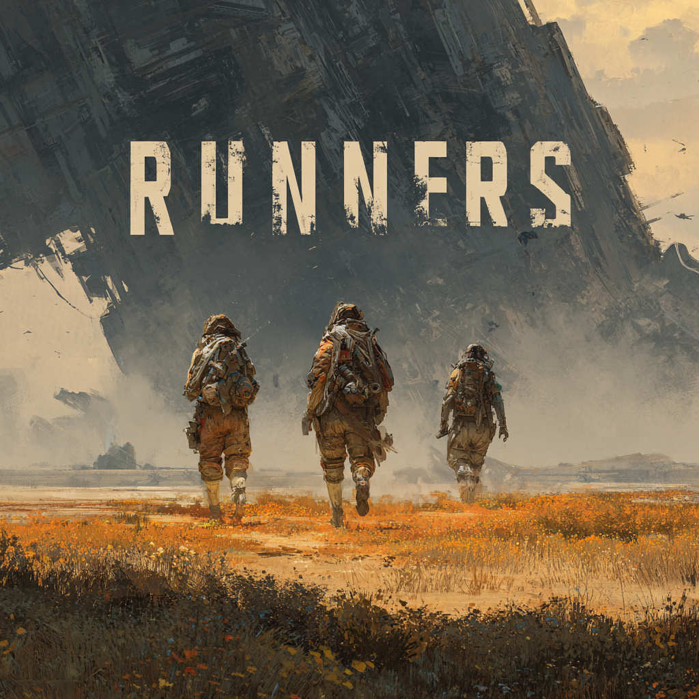

<p align="center">
  
</p>

<p align="center">
  A futuristic PvPvE extraction shooter built with Python and Pygame, inspired by the classic Marathon game by Bungie. Explore a hostile map, complete challenges, loot enemies, and extract before the round ends to upgrade your character and home base.
</p>

---

[](https://github.com/JabbaghYounes/Ricky)

## Features

- **Competitive PvP & PvE gameplay** — fight humanoid robot enemies and other players
- **15-minute extraction rounds** — explore, loot, and get out before time runs out
- **Shooting & weapons** — mouse-aimed projectiles with configurable weapon stats, reload, and attachments
- **Loot & inventory** — collect weapons, armor, consumables, and weapon mods
- **Weapon attachments** — scope, barrel, grip slots that modify weapon stats
- **Skill tree progression** — combat and mobility branches with prerequisite nodes and stat bonuses
- **Home base upgrades** — spend earnings between rounds on permanent upgrades
- **XP & leveling** — earn XP from kills and extractions, unlock level-gated content
- **Vendor challenges** — data-driven objectives with bonus XP/money rewards
- **Save/load system** — full persistence of inventory, progression, skills, and home base
- **Dynamic audio** — zone-based background music and sound effects
- **HUD overlay** — health, ammo, timer, mini-map, XP bar, and challenge tracking

## Controls

| Action | Key |
|--------|-----|
| Move | WASD |
| Crouch | Ctrl |
| Jump | Space |
| Sprint | Shift |
| Slide | C |
| Pick up items/weapons | E |
| Open map | M |
| Open inventory | Tab |
| Aim / Shoot | Mouse |
| Reload | R |
| Pause | Escape |

## Installation

```bash
git clone https://github.com/JabbaghYounes/Runners.git
cd Runners
pip install -r requirements.txt
python main.py
```

**Requirements:** Python 3.10+, Pygame 2.x

## Project Structure

```
Runners/
├── main.py                  # Entry point
├── requirements.txt
├── assets/                  # Sprites, sound effects, music
│   ├── music/
│   ├── sounds/
│   └── sprites/
├── data/                    # JSON game data (enemies, items, maps, skills, challenges)
├── src/
│   ├── core/                # Event bus, settings, asset manager, scene manager
│   ├── entities/            # Player, enemy, projectile, loot drop, PvP bot
│   ├── inventory/           # Items, inventory, weapon attachments
│   ├── map/                 # Tile map, camera, zones
│   ├── progression/         # XP system, skill tree, home base
│   ├── save/                # Save/load manager
│   ├── scenes/              # Game scene, menus, home base, post-round
│   ├── systems/             # AI, audio, combat, physics, shooting, challenges
│   └── ui/                  # HUD, mini-map, widgets
├── tests/                   # Pytest test suite (2369 tests)
└── ricky/                   # AI swarm toolkit (PRD → features → PRs)
```

## Running Tests

```bash
pytest                        # Run all tests
pytest tests/test_player.py   # Run a single test file
pytest -q                     # Quiet output
```

## Contributing

1. Fork the repository
2. Create a new branch: `git checkout -b feature/my-feature`
3. Make your changes and commit: `git commit -m "Add feature"`
4. Push to the branch: `git push origin feature/my-feature`
5. Open a pull request

## License

This project is licensed under the MIT License — see the [LICENSE](LICENSE) file for details.

## Future Plans

- Multiple maps & zones
- More playable characters with unique abilities
- Online leaderboards and matchmaking
- Advanced AI behaviors for PvE robots
